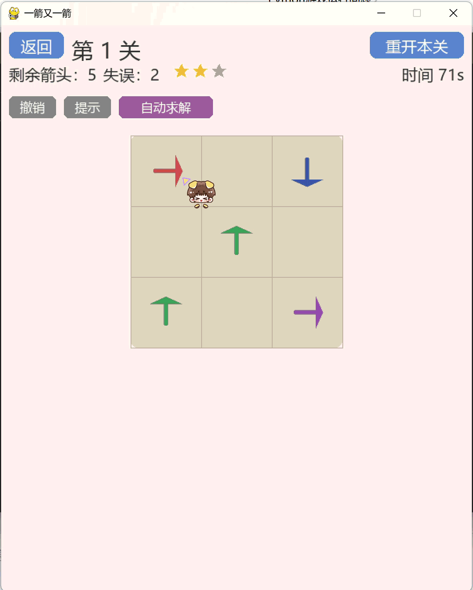
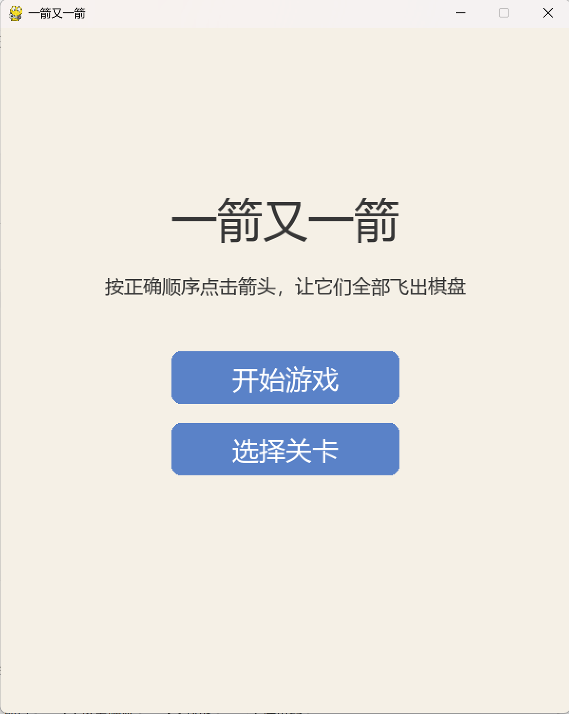
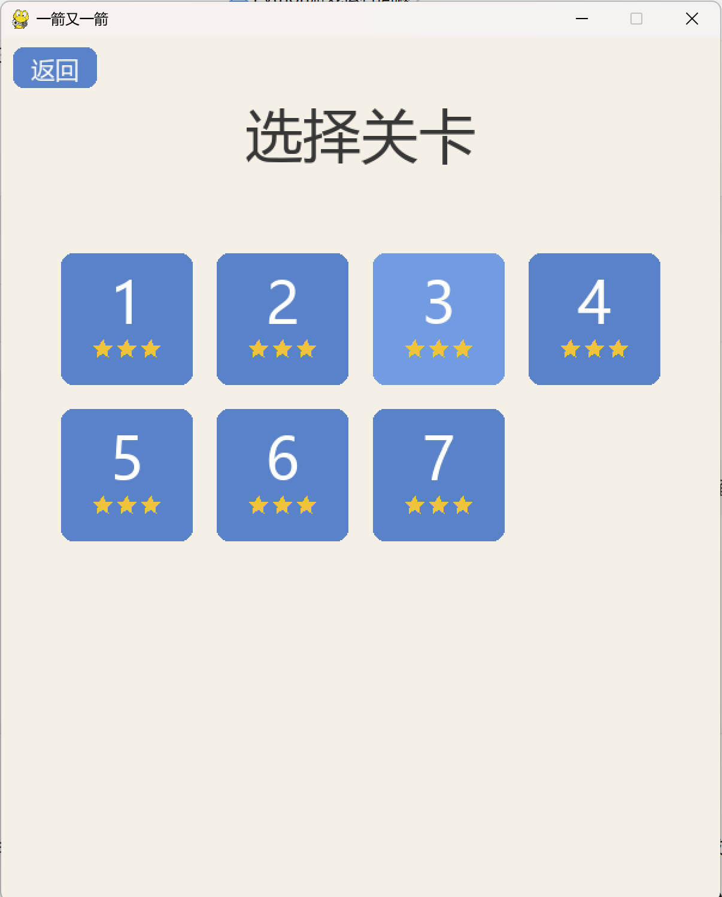
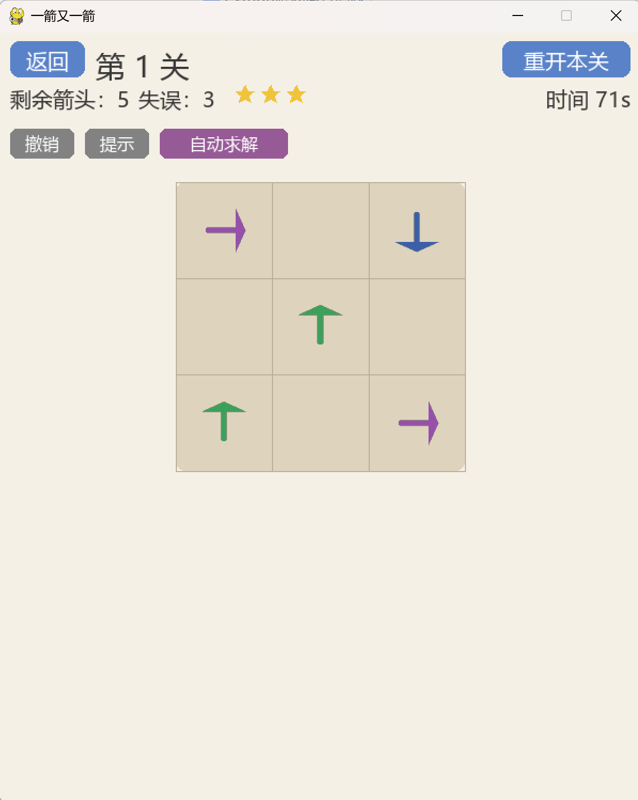
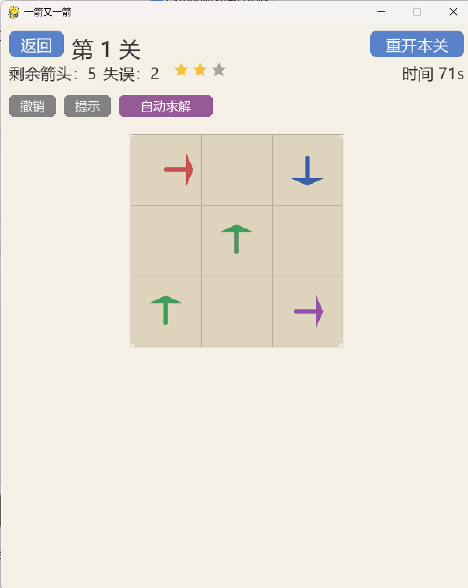
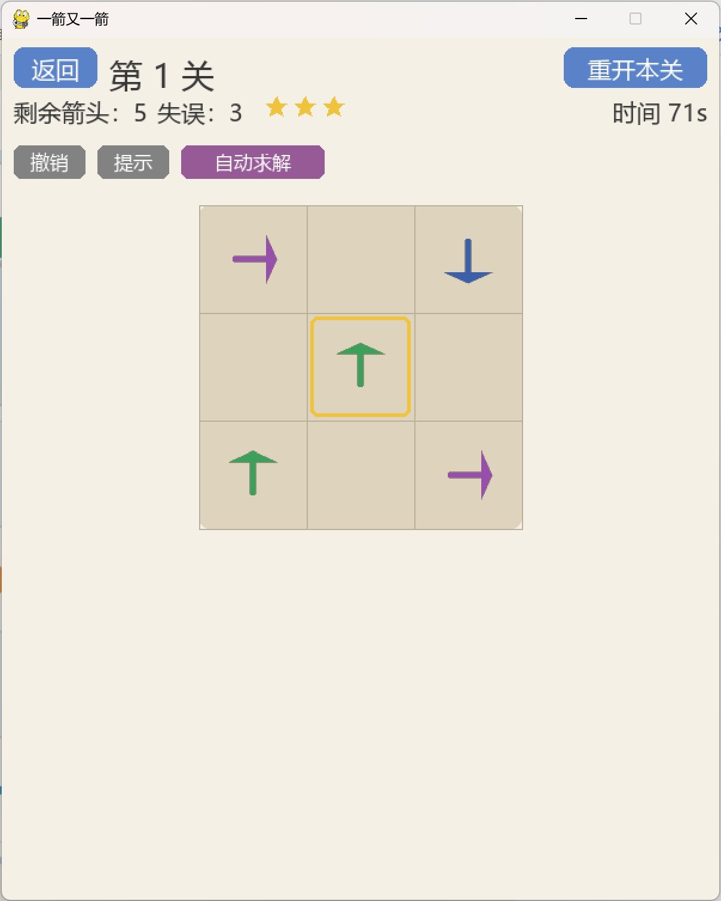
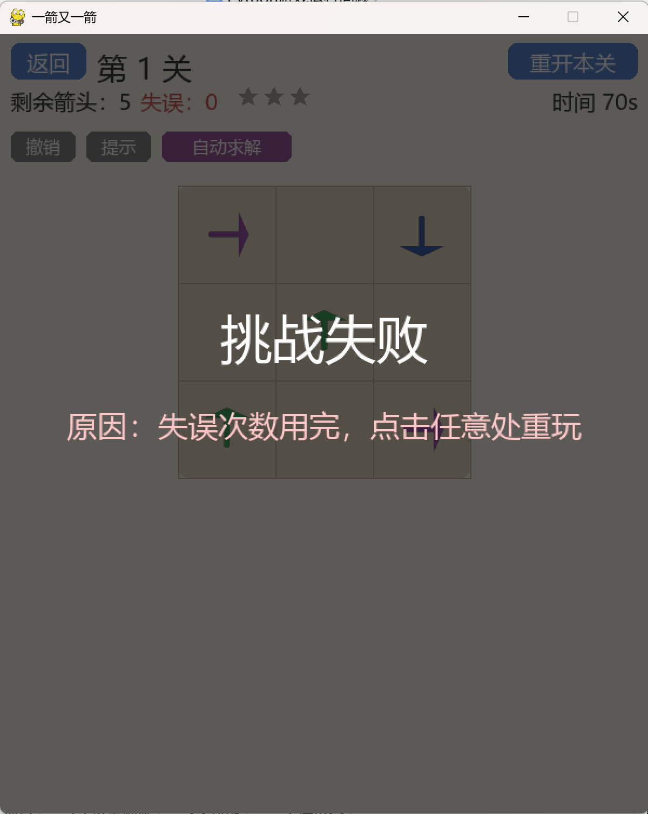
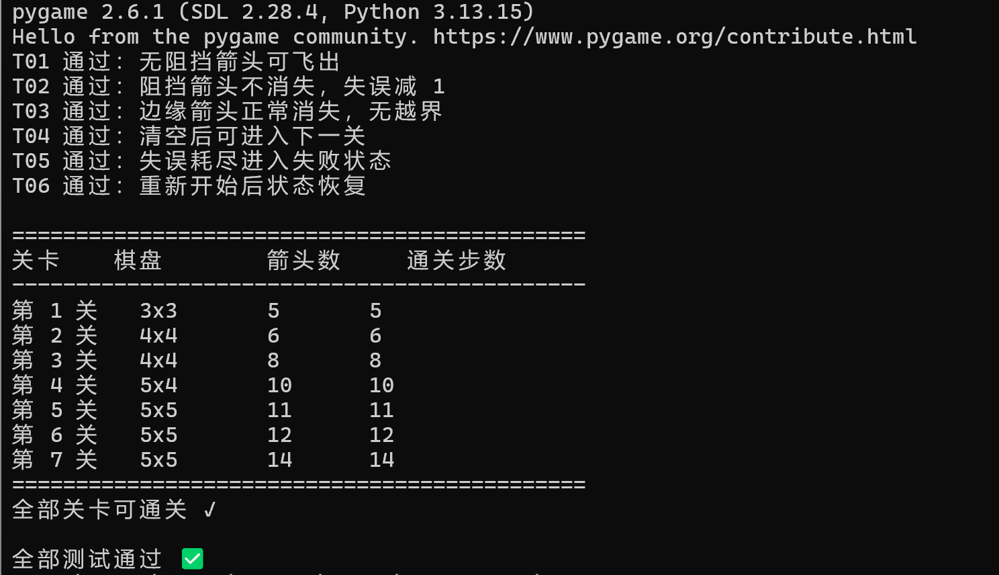

# 一箭又一箭（One Arrow After Another）

> 软件工程课程第二次个人作业 —— 基于 Python + Pygame 的点击式箭头解谜小游戏

## 游戏简介

"一箭又一箭"是一类点击式箭头解谜游戏。棋盘中分布着若干方向为上 / 下 / 左 / 右的箭头，玩家需要观察箭头之间的阻挡关系，按照正确顺序点击箭头，使所有箭头依次飞出棋盘。

- 若点击的箭头沿指向方向到棋盘边界之间**没有其他箭头**，箭头飞出棋盘并被消除；
- 若路径上存在其他箭头，箭头沿方向飞出一段再弹回并变红，同时消耗 1 次失误、失去 1 颗星；
- 每关限失误 **3 次**、限时 **75 秒**，任一耗尽则本关失败；
- 通关后按剩余失误评 **1–3 颗星**（零失误 = 3 星）；
- 共 **7 个关卡**，带选关界面，通关进度自动存档。

核心玩法参考微信小游戏《一箭又一箭》，仅参考玩法规则，代码、素材与关卡均为原创。

## 演示



## 附加功能

- **倒计时**：每关 75 秒，剩余 10 秒变红警告；
- **三星评价**：初始 3 星，每失误一次扣 1 星，通关后自动保存最高星数；
- **提示功能**：点击"提示"按钮，金色闪烁框高亮一个当前可消除的箭头；
- **撤销上一步**：点击"撤销"按钮，恢复上一个被消除的箭头；
- **AI 自动求解**：点击"自动求解"按钮，回溯算法自动找到通关顺序并演示；
- **选关界面**：7 关按顺序解锁，已通关显示金色星星；
- **本地存档**：`progress.json` 自动记录已解锁关卡和每关最高星数；
- **抗锯齿箭头**：四种方向不同颜色（上绿、下蓝、左橙、右紫），2 倍超采样渲染。

## 开发环境

- Python 3.13
- Pygame 2.6+

## 安装和运行方法

```bash
# 1. 安装依赖
pip install -r requirements.txt

# 2. 运行游戏
python one_arrow_game.py
```

运行测试：

```bash
python test_game.py
```

## 游戏操作说明

| 操作 | 说明 |
|---|---|
| 鼠标左键点击箭头 | 尝试让箭头飞出棋盘 |
| 点击"撤销"按钮 | 恢复上一个被消除的箭头 |
| 点击"提示"按钮 | 金色高亮一个当前可消除的箭头 |
| 点击"自动求解"按钮 | AI 自动演示通关 |
| 点击"重开本关"按钮 | 当前关恢复初始状态 |
| 点击"返回"按钮 | 返回选关界面 |

## 游戏截图

开始界面：



选关界面：



游戏界面：



碰撞/失误反馈（箭头弹出变红后弹回，失误次数减 1）：



提示功能（金色闪烁高亮可消除箭头）：



失败界面：



可解性测试结果（每关箭头数与通关步数）：



## 项目结构

```
.
├── one_arrow_game.py   # 游戏主程序（界面、逻辑、动画）
├── test_game.py        # T01-T06 自动化测试 + 关卡可解性验证
├── requirements.txt    # 依赖列表
├── screenshots/        # 游戏截图
├── .gitignore
└── README.md
```

## 实现要点

- **棋盘**：二维列表，单元格为 `None` 或 `'U'/'D'/'L'/'R'`。
- **方向**：`DIRS = {'U': (-1,0), 'D': (1,0), 'L': (0,-1), 'R': (0,1)}`。
- **路径检测**：从被点箭头沿方向向量逐格走到边界，遇非空即阻挡。
- **碰撞动画**：被挡箭头沿方向飞出 30px 再弹回，同时变红。
- **计时**：每关 75 秒，用 `time.time()` 差值计算。
- **星级**：初始 3 星，每失误一次减 1；通关后存档。
- **撤销**：用栈记录已消除的 `(row, col, dir)`，弹出后恢复。
- **自动求解**：回溯搜索，找到一条通关路径后按 0.6 秒间隔自动点击。
- **存档**：`progress.json` 记录已解锁关卡数和每关最高星数。
